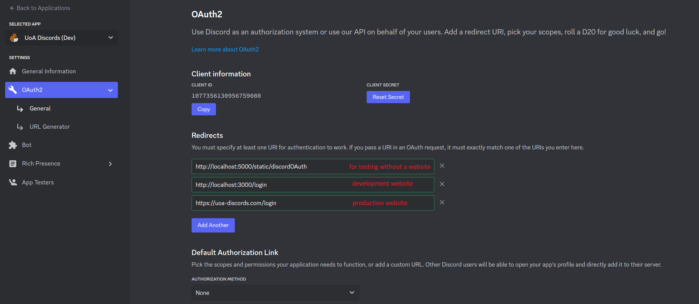

# Setting up Discord OAuth

1. Go to your [Discord applications dashboard](https://discord.com/developers/applications) and create a new application.

2. Go to the OAuth2 > General page and copy down your client ID and client secret.

3. Add any redirect URIs, this could be the URL of your website which handles the logging in process, or a test endpoint, see the image below.

Now you can put the client ID and secret into `config.json`, done!

# Using Discord OAuth

Generate a Discord authorization URL using the Discord URL Generator:

1. Once you get redirected to wherever you set the `REDIRECT_URI` to, the `state` and `code` values will be in the URL query parameters.

    - `state` should be used client-side to prevent CSRF attacks.
    - `code` is used to send in a POST request to http://localhost:5000/login to be upgraded into a full access token, logging the user into the site.
        - The request body should also include the `REDIRECT_URI` used in step 1.
