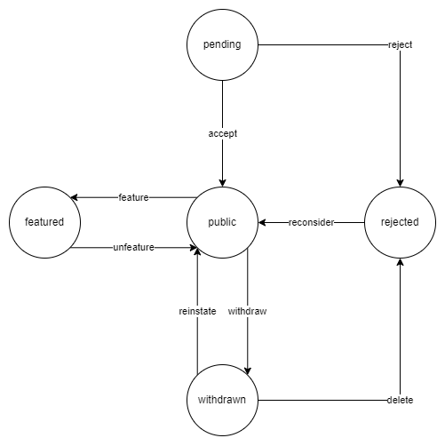

# UoA Discords / Server Registry API

[](https://github.com/UoA-Discords/api/actions/workflows/node.js.ci.yml)
[](https://github.com/UoA-Discords/api/actions/workflows/codeql-analysis.yml)
[](https://github.com/UoA-Discords/api/actions/workflows/deploy.yml)
[](https://codecov.io/gh/UoA-Discords/api)

This is the API for our UoA Discord server registry, an online catalogue of various University of Auckland Discord servers.

We are not affiliated with the University of Auckland in any official capacity.

The production version of this API exists at https://registry.uoa-discords.com, and the documentation can be found [here](https://registry.uoa-discords.com/api-docs).

## Table of Contents

-   [Installation](#installation)
-   [Documentation](#documentation)
    -   [Script Reference](#script-reference)
    -   [Dependency Reference](#dependency-reference)
    -   [Production Build](#production-build)
-   [Contributing](#contributing)
-   [Licensing](#licensing)
-   [FAQ](#faq)

### Installation

Dependencies:

-   [Node JS](https://nodejs.org/en/) v16 or higher. Non-LTS and versions below 16 will probably work, but haven't been tested.
-   [pnpm](https://pnpm.io/), recommended but npm and yarn should still work fine.

You can easily get pnpm using:

```sh
npm i -g pnpm
```

This API uses [MongoDB](https://www.mongodb.com/) for persistent data storage and [Discord OAuth](https://discord.com/developers/docs/topics/oauth2) for user authentication. This means you will need to set up:

-   A MongoDB cluster and provide a connection URI for it (`mongodb+srv://...`).
    -   See [setting up MongoDB](./.github/docs/MongoDBGuide.md).
-   A Discord application and provide it's client ID and secret.
    -   See [setting up Discord OAuth](./.github/docs/DiscordOAuthGuide.md).

Next you can set up the repository from a terminal:

```sh
git clone https://github.com/UoA-Discords/server-registry-api.git server-registry-api
cd server-registry-api
pnpm install
cp config.example.json config.json
```

Finally enter your Mongo URI and Discord client ID and secret into the [config.json](./config.json) file you just created. There are a lot of other configuration options you can give to the API, and a JSON schema for all the values can be found [here](.github/config-schema.json).

All done! You can now run scripts using `pnpm <script name>`, e.g. `pnpm start`. See the [script reference](#script-reference) below to get started.

### Documentation

#### Script Reference

-   `start` Starts API with hot-reloading enabled.
-   `build` Compiles API into JavaScript.
-   `lint` Makes sure code follows style rules.
-   `typecheck` Makes sure there are no type errors in the code.
-   `test` Runs testing using Jest.
-   `check-all` Does linting, typechecking, and testing; note that this requires pnpm.

#### Dependency Reference

-   `axios` Makes web requests easy.
-   `cors` Allows configured websites to use the API.
-   `express` Web framework the API uses.
-   `express-openapi-validator` Ensures endpoints match their documentation.
-   `express-rate-limit` Rate limits users of the API.
-   `jsonwebtoken` Helps with user authorization and sessions.
-   `mongodb` Database interface.
-   `swagger-ui-express` Framework for API documentation.

#### Production Build

Remember to set the `NODE_ENV` environment variable to `production` if you want to start the API in production mode.

```sh
# Linux & Mac
export NODE_ENV=production

# Windows
$env:NODE_ENV = 'production'
```

Afterwards you can compile the app using `pnpm build` and run it using `node .`

### Contributing

Contributions are always welcome, check out [CONTRIBUTING.md](./.github/CONTRIBUTING.md) to get started.

### Licensing

This API is licensed under the [MIT license](./LICENSE).

### FAQ

Trying out any operation in the [api-spec](https://registry.uoa-discords.com/api-spec) returns "Failed to fetch", how do I fix this?

> Make sure your server (at the top of the page) is set to `registry.uoa-discords.com`, since by default it looks for your development server which might not be running.
>
> 

I've set up a local version of the API and logged in, but I don't seem to have any permissions?

> You'll need to edit your user in MongoDB to give yourself the `Owner` permission (value 8).

What are the possible statuses of a server in the registry?

> 
